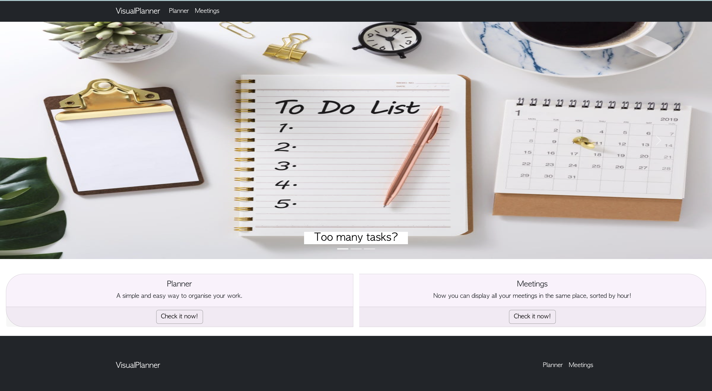

<!-- @format -->

# VisualPlanner

## Table of contents

1. [Description](#description)
2. [Features](#features)
3. [Installation](#installation)
4. [Usage](#usage)
5. [Requirements](#requirements)
6. [Technologies](#technologies)
7. [Authors](#authors)
8. [Credits](#credits)
9. [License](#licence)
10. [Deployed-website](#deployed-website)

## Description

VisualPlanner provides an intuitive interface for users to manage their tasks and meetings. The app is built using React, with react-bootstrap for styling and layout, react-router and react-router-dom for navigation between pages, and **World Time API** for capturing task creation times. Additionally, the ToDo component uses two React packages: **react-toastify** and **react-icons**.

## Features

- HomePage with an overview of the app's functionality
- Planner Page with the ToDo component:
  - Add new todos with a timestamp
  - Remove todos
  - Mark todos as completed
  - Display notifications using react-toastify when the user doesn't fill the forms
  - Stylish icons using react-icons
- Meeting Page with the Meetings component:
  - Add new meetings with a timestamp
  - Remove meetings
  - Mark meetings as completed
  - Organize and sort meetings based on time

## Installation

1. Clone the repository: **https://github.com/Aaliya313/React_App.git**

2. Change to the project directory: cd visual-planner

3. Install the required dependencies: npm install

4. Start the development server: npm start

The app should now be running on http://localhost:3000.

## Usage

1. Open the app in your web browser.

2. On the HomePage, you will find two main features: Planner and Meetings.

3. To use the Planner component, navigate to the Planner page:

   - Add a new todo by filling in the input field and clicking the "Add todo" button.
   - Remove todos by clicking the Remove icon.
   - Mark todos as completed by clicking on the todo.
   - A notification will appear if the user's input is incorrect.

4. To use the Meetings component, navigate to the Meeting page:

   - Add a new meeting by filling in the input fields and clicking the "Add meeting" button.
   - Add the time for the meeting.
   - Remove meetings by clicking the "Remove meeting" button.
   - Mark meetings as completed by clicking the "Mark as completed" button.
   - The list of meetings will be sorted based on their scheduled times.

## Requirements

- Use React.

- Use Node.js

- Have both GET and GET routes for retrieving and adding new data.

- Be deployed using Netlify.

- Use at least two libraries, packages, or technologies that we haven't discussed.

- Have a polished front end/UI.

- Meet good quality coding standards (indentation, scoping, naming).

- Have a quality README (with unique name, description, technologies used, screenshot, and link to deployed application).

## Technologies

- reactJS
- JSX
- react hooks (useState)
- react-router and react-router-dom
- react-bootstrap
- react-toastily and react-icons
- World Time API

## Authors

- [Aaliya ladha](https://github.com/Aaliya313/)
- [Oluwatayo Hassan](https://github.com/BABATEES)
- [Tina Georgescu](https://github.com/cristinabadea)
- [Raji Labana](https://github.com/lotussi)

## Credits

- 

- 

- 

- 

- 

- 

- [World Time API](https://rapidapi.com/brianiswu/api/world-time2/)

## Licence

- 

## Deployed website:

[VisualPlanner](https://visual-planner-21.netlify.app/)
